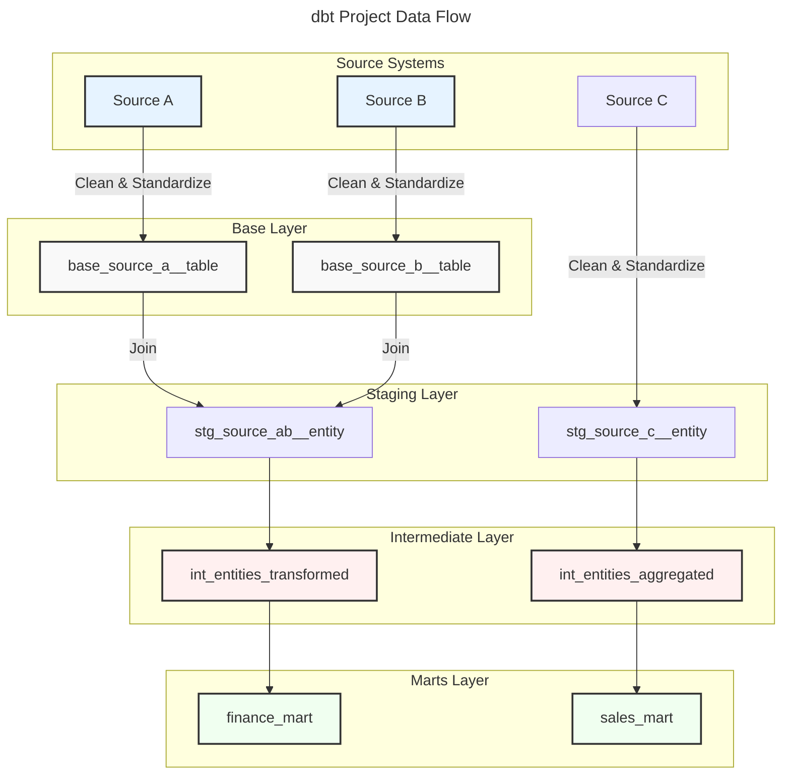
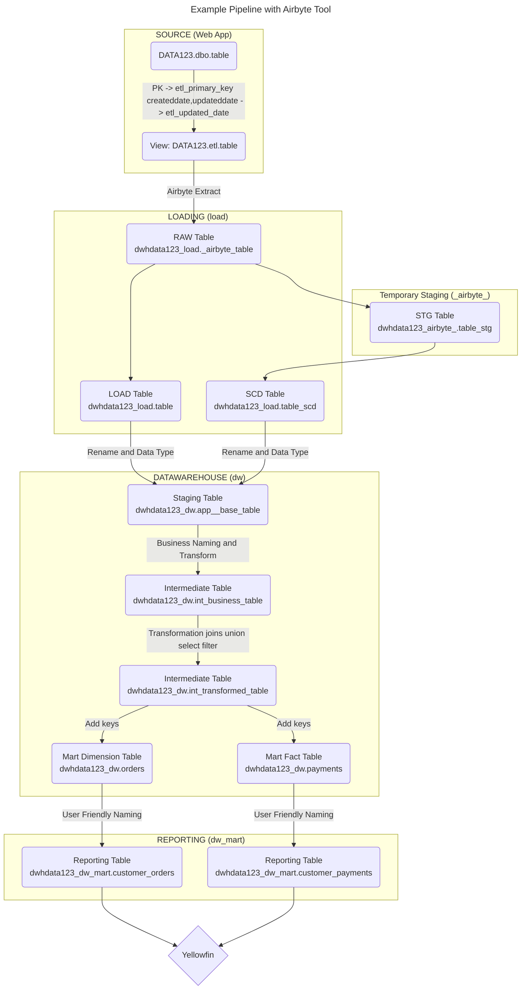

## Project Structure

dbt projects should follow a consistent structure to enhance collaboration, maintainability, and scalability. The key principle is to move data from source-conformed to business-conformed models through a series of transformation layers.

```
jaffle_shop
├── README.md
├── analyses
├── seeds
│   └── employees.csv
├── dbt_project.yml
├── macros
│   └── cents_to_dollars.sql
├── models
│   ├── intermediate
│   │   └── finance
│   │       ├── _int_finance__models.yml
│   │       └── int_payments_pivoted_to_orders.sql
│   ├── marts
│   │   ├── finance
│   │   │   ├── _finance__models.yml
│   │   │   ├── orders.sql
│   │   │   └── payments.sql
│   │   └── marketing
│   │       ├── _marketing__models.yml
│   │       └── customers.sql
│   ├── staging
│   │   ├── jaffle_shop
│   │   │   ├── _jaffle_shop__docs.md
│   │   │   ├── _jaffle_shop__models.yml
│   │   │   ├── _jaffle_shop__sources.yml
│   │   │   ├── base
│   │   │   │   ├── base_jaffle_shop__customers.sql
│   │   │   │   └── base_jaffle_shop__deleted_customers.sql
│   │   │   ├── stg_jaffle_shop__customers.sql
│   │   │   └── stg_jaffle_shop__orders.sql
│   │   └── stripe
│   │       ├── _stripe__models.yml
│   │       ├── _stripe__sources.yml
│   │       └── stg_stripe__payments.sql
│   └── utilities
│       └── all_dates.sql
├── packages.yml
├── snapshots
└── tests
    └── assert_positive_value_for_total_amount.sql
```



### Sources Layer

#### Scenario: Source system is accessible from the same database as the data warehouse target but different schema

- Postgres database
  - source schema: jaffle_shop (operational data from the faffle_shop app)
  - target schema: dw (data warehouse)

- MS SQL Server Database
  - source schema: Linked server name (e.g. `prod`)
  - target schema: dw (data warehouse)

- BigQuery Project (Database)
  - source dataset (schema): raw
    - external table: GCS bucket csv, jsonl, googlesheets
    - federated queries: https://cloud.google.com/bigquery/docs/federated-queries-intro
  - target schema: dw (data warehouse)

- External Tables package
  - source: https://github.com/dbt-labs/dbt-external-tables
  - target schema: dw (data warehouse)
  - sample code from integration tests: https://github.com/dbt-labs/dbt-external-tables/tree/main/integration_tests/models/plugins

#### Scenario: Extract Load tool extracts and load source tables into a schema accessible by the data warehouse target

##### Extract Load Tools

- Fivetran
- Airbyte
- Apache Hop
- AWS Data Wrangler
- Pentaho Data Integration (Kettle/WebSpoon)


### Staging Layer

- **Purpose**: Create atomic building blocks from source data
- **Folder Structure**: Subdirectories based on source systems (e.g., `jaffle_shop`, `stripe`)
- **Naming Convention**: `stg_[source]__[entity]s.sql`
- **Transformations**: Renaming, type casting, basic computations, and categorizing
- **Materialization**: Views (materialization note below)
- **Best Practices**:
  - One-to-one relationship with source tables
  - Avoid joins and aggregations
  - Use base models for necessary joins (e.g., delete tables)

#### Base tables
- When a staging table is required to be transformed with joins of other tables, a base table is created from the component tables
- Staging tables is then created from the base tables
- Staging tables are the business-named tables that represent the objects of the business

#### Materialization

- Create a view for each source table in the staging schema
  - When the source tables are reliable and is the original source, never purged

- Create an incremental table for each source table in the staging schema
  - When the source tables are extracted by a tool and is able to truncate the table

- Huge source tables
  - Create a view (or a link) to the source table accessible from the staging schema (No ETL)
  - Set materialization to incremental
    - identify the PK columns and the updated_at column
    - make sure they are indexed/partitioned at the source table

### Intermediate Layer

- **Purpose**: Create purpose-built transformation steps
- **Folder Structure**: Subdirectories based on business groupings
- **Naming Convention**: `int_[entity]s_[verb]s.sql`
- **Common Use Cases**: Structural simplification, re-graining, isolating complex operations
- **Materialization**: Ephemeral or views in a custom schema
- **Best Practices**:
  - Focus on single-purpose transformations
  - Allow multiple inputs but aim for single outputs

### Marts Layer

- **Purpose**: Create business-defined entities for end-users
- **Folder Structure**: Group by department or area of concern
- **Naming Convention**: Name by entity (e.g., `customers`, `orders`)
- **Characteristics**: Wide and denormalized
- **Materialization**: Tables or incremental models
- **Best Practices**:
  - Avoid too many joins in one mart
  - Build on separate marts thoughtfully

### YAML Configuration

- **Recommendation**: Config per folder (`_[directory]__models.yml`)
- **Best Practices**:
  - Use leading underscore for YAML files
  - Cascade configs in `dbt_project.yml`
  - Use folder structure for selections instead of excessive tagging

### Other Folders

- **Seeds**: For lookup tables, not source data
- **Analyses**: For storing auditing queries
- **Tests**: For testing multiple specific tables simultaneously
- **Snapshots**: For creating Type 2 slowly changing dimension records
- **Macros**: For DRY-ing up repeated transformations

### Project Splitting

- **Recommended**: Use dbt Mesh for connecting multiple projects
- **Valid Reasons**: Business groups/departments, data governance, project size
- **Not Recommended**: Splitting based on ML vs. Reporting use cases

Remember, consistency is key. Customize this structure to fit your organization's needs, but always document your reasoning for deviations.

## References

- [dbt-utils](https://github.com/dbt-labs/dbt_utils) - dbt-utils is a package of macros which are helpful for a large number of dbt projects.
- [How we structure our projects](https://docs.getdbt.com/best-practices/how-we-structure/1-guide-overview) - dbt best practices for structuring projects.
  - [Staging](https://docs.getdbt.com/best-practices/how-we-structure/2-staging)
  - [Intermediate](https://docs.getdbt.com/best-practices/how-we-structure/3-intermediate)
  - [Marts](https://docs.getdbt.com/best-practices/how-we-structure/4-marts)
  - [The rest of the project](https://docs.getdbt.com/best-practices/how-we-structure/5-the-rest-of-the-project)


## Example Pipeline with Airbyte Tool




Notes:
Source tables:
- Not accessibe from the data warehouse database
- When tables are not performant, tables can be purged to last 3 years
- Some tables have no PK Index
- Some tables do not comply to the admin column naming convention or data type
- Created date should never be null but can be null
- Modified date is null when row is not modified before
- App schema cannot be modified - indexes, add column, change columns etc as it will impact App software
- Created a ETL Schema that wraps a view over each table and standardise the treatment of updated date and modified date and present the PK as a single column as a concat of the Multi key column values
- SCD loading handled by Airbyte

Staging:
- Requirement to update the reporting layer every 5 minutes
- Materialized as an incremental table to prevent data loss when app data is purged
- Naming of source admin columns and dada types are normalized here
- UTC Time is calculated and columns in UTC are added
- table and column names are normalized from Camel case to snake case

Schemas:
- ETL schema is used for ETL Tool's load tables
- DW schema is used for base, staging, intermediate and mart tables
- Reporting schema are views from Mart Tables renamed for report builders

Governance:
- Views in reporting schema are only sourced from mart tables (Control?)
- When UAT by Report builders are completed then contract in the mart models are Created
- Documentation flows from staging tables to intermediate tables and to mart tables
- Group access
