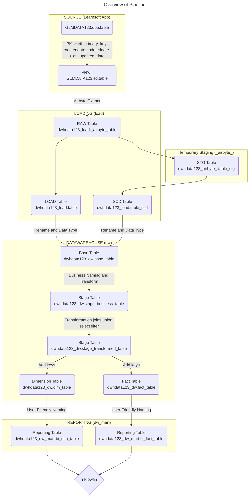

# Project Overview

* Learnsoft App uses MS SQL Server as the Database
* Each client that subscribes to Learnsoft App has its own database
* The data from the app source tables are copied to the Data Warehouse tables in AlloyDB where each client's data is in a separate schema.
* In the data warehouse, the tables are used to create other intermediate views/tables that eventually will be consumed by a BI Tool.
* The transformation process is done using dbt.

## Pipeline




# Source to Load
* Requirement to extract current table and historical SCD (insert new and changed or deleted rows)
* SCD extraction requires a PK column to deduplicate rows and a updated_date column to detect changes
* Source table do not always have a PK column
* Source table has created date and updated date columns with the following rules
   * Created date is updated upon row creation
   * Updated date column is only updated whenever the row has been changed
   * When there are manual changes to tables, both columns are not updated
   * There are cases where both created and updated columns are both NULL
* For every database in source (GLMDATA100), a new schema "ETL" is created and for every table in "dbo" schema, a view in ETL with exactly the same name with 2 new columns created
   * etl_primary_key - a string concat of columns found in the PK index of the source table
   * etl_updated_date - coalesce(updateddate, createddate, cast('1970-01-01' as datetime))

# Schema Naming Convention

## dw_mart for Report builders
* Report builder will only be given access to tables in schema named `dw_mart`
* All tables in `dw_mart` schema will have user friendly column names ready to be used in Yellowfin
   * `Order ID` instead of `order_id`
   * Descriptions will be persisted with the table and columns

## dw for data warehouse developers
* Data warehouse developers will be using schema `dw` to develop the modeling and transformations
* Columns of all tables in `dw` will be named in lowercase snake_case

## load schema for load tables
* ETL will populate the tables in `server_name` schema (ie. dwhdata58) from the source systems

## dw_admin for datawarehouse admin
* ETL Job logs
* dbt job logs
* Metadata analysis tables

## Handling multiple source systems
* Each source system will have its own schema
  * dwhdata123_load

## Handling multiple data marts
* Each data mart will have its own schema
  * dwhdata123_dw_mart
  * dwhdata123_dw

# Data Warehouse Design

## Base models

Base models are tables built from Load tables, and shows the data as it was loaded incrementally. This means uniqueness is enforced and deletes are not propagated, so base tables contain the full incremental change history (without deletes) since the sync began.

Base models enforce the following rules:

- Table names are prefixed base_, and followed by the source names, converted to lowercase snake case
- Base tables only source data from Load tables
- Base tables represent only one raw object, and do not perform joins
- Metadata from the loading process (such as airbyte_ columns) are removed
- Data type coercions are enforced, data_type changes are also done here (timestamps -> date)
- Column names are converted to lower case snake case
- Primary ID columns are named with suffix _id and  preserved for key generation in stage models
Base models are a clean, tabular look into the data as retrieved from source system incrementally.

## Stage models

Stage models are (by default) views enforcing uniqueness constraints, removing records marked as deleted.
The goal is to present data in a flat tabular format for further analytics.

Stage models enforce the rules:

- Table names are prefixed stg_.
- Deleted records are removed
- When sourced from SCD load tables, uniqueness constraints are enforced, and only the most recent version of any element is preserved.
- Stage models are a true representation of data as of the last sync, ready for further use directly.

Transformations are applied to the data in stage models, such as:
- Table renaming to business names (load.usergroup -> dw.base_user_group -> dw.user_role)
- Column renaming to business names (groupid -> group_id  role_id -> user_role_id or learner_role_id)
- Table joins to create a single table from multiple sources (load.usergroup, load.user, load.group -> dw.base_user_group, dw.base_user, dw.base_group)
- Column lookups to replace foreign keys with values from lookup tables (user_role_id -> user_role_name)
- Column to column transformation (datediff(end_date - start_date) as duration_in_days)
- Aggregation (group by then sum, count, avg, etc.)
- Rows to column transformation (count(*) over (partition by user_id) group_count)

## Key Generation in Building Dimension and Fact Tables

## Dimension tables
Dimension tables are materialized as physical tables in the data warehouse.  It represents the final product for consumption by BI Tools
We use multiple natural keys for joins, and our goal is to simplify this down to a single column key with consistent naming.

Surrogate keys follow these conventions:
- All surrogate keys are suffixed with _sk
- The key name should align to a resource specified in the singular, such as user_key, course_key
- If a table must contain multiple foreign keys to the same object, they are disambiguated with double underscores, such as user__responsibility_key and course__assignment_key
- Keys (or other columns contributing to table uniqueness) should be the leftmost columns in a table, generally from least to most distinct values.
- Keys are md5hashes of the underlying natural keys concatanated together

## Administrative columns

Source system uses the following audit columns:
- `created_date` - timestamp of when the record was created in the source system (should never be NULL)
- `updated_date` - timestamp of when the record was last updated in the source system (NULL if not updated)
- `created_by_user_id` - user who created the record in the source system (should never be NULL)
- `updated_by_user_id` - user who last updated the record in the source system (NULL if not updated)
- `etl_updated_date`
- `etl_primary_key`

## Deletion handling
Some tables have is_deleted flag for soft deletes.

- `is_deleted` - boolean flag to indicate if the record has been deleted in the source system (optional.  If exists can be NULL)

# Frequently Run commands

## Clean up
1. Clean up the target folder where compiled models and run models are saved.  Ensure that models are created from scratch without using any cached intermediate results.
2. Drop the tables in target database that are no longer needed.  This is useful when the models have changed and the tables are no longer needed.

```bash
dbt clean
dbt run-operation drop_old_relations --args '{"dry_run": False}'
```

## Initialize the tables in target db
1. Drop tables in target database and re-create them.
2. Generate the seed tables
3. Run the models to populate the tables with full-refresh

```bash
dbt run-operation drop_relations --args '{"dry_run": False}'
dbt seed
dbt test
dbt run --full-refresh
```

## Normal run to incrementally load from Load tables
```bash
dbt run
```


## dbt power user logs

\\wsl.localhost\Ubuntu\home\herman\.vscode-server\data\logs

\\wsl.localhost\Ubuntu\home\herman\.vscode-server\data\logs\20240617T170853\exthost3\innoverio.vscode-dbt-power-user\Log - dbt.log

# Implementation Notes

## Null created and updated dates
There are 2 possible behaviour on processing of tables containing double nulls in created and updated dates
1. Set the `etl_updated_date` to the current date in the coalesce
      All null rows will be synced at every pull.
2. Set the `etl_updated_date` to 1970-01-01
      All null rows will only be pulled for the initial load only and ignored in subsequent pulls.

We have implemnented the logic using the second method and reflected in the code in the [repo](https://bitbucket.org/learnsofttechgroup/extract-load/src/staging/make_views.py#lines-132)

## Tables with no PK
